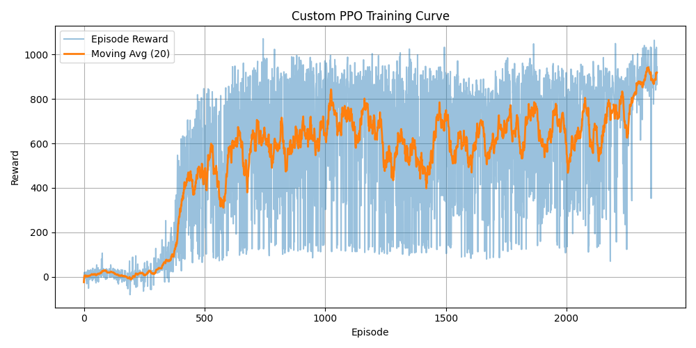
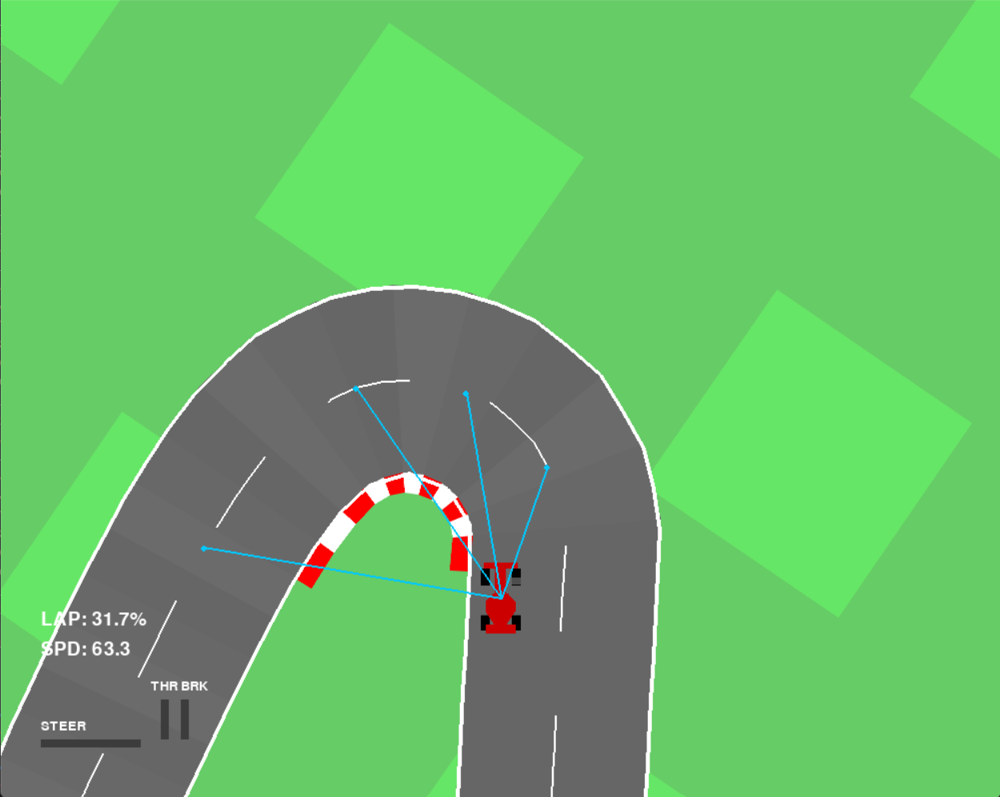

# 🏎️ PPO Racing Agent

> A reinforcement learning project that uses engineered state representations and a custom implementation of Proximal Policy Optimization (PPO) in PyTorch to autonomously navigate a modified Gymnasium CarRacing environment.

<p align="center">


</p>
---

## 🎥 Demo

<p align="center">
  
</p>

<p align="center">
<i>The trained PPO agent driving autonomously in the modified CarRacing environment.</i>
</p>

For the full-resolution demonstration, see **assets/demo.mp4**.
---

## 📖 Overview

Autonomous racing is commonly approached by training reinforcement learning agents directly from raw RGB images using convolutional neural networks. While effective, image-based policies require significantly more computation and learning complexity.

This project explores an alternative approach by replacing image observations with an engineered numerical state representation extracted from the environment. These handcrafted features provide compact, task-relevant information that enables the agent to focus on decision-making rather than visual perception.

The project includes a modified Gymnasium CarRacing environment, a custom implementation of Proximal Policy Optimization (PPO) in PyTorch, and a complete training and evaluation pipeline for continuous autonomous driving.
---

## ✨ Features

- 🏎️ **Modified Gymnasium CarRacing Environment** with engineered numerical observations.
- 🧠 **Custom PPO Implementation** built from scratch in PyTorch for continuous control.
- 📊 **Engineered State Representation** replacing raw RGB image observations with compact, task-relevant features.
- 🎯 **Reward Engineering** designed to encourage stable and efficient driving behavior.
- 🚗 **Continuous Action Space** supporting smooth steering, throttle, and braking.
- 📈 **Training & Evaluation Pipeline** with checkpointing, testing, and reward visualization.
- 📄 **Comprehensive Project Report** documenting the methodology, implementation, and results.

---

## 📈 Results

### Training Performance

<p align="center">
  
</p>

<p align="center">
<i>Training reward progression of the custom PPO agent.</i>
</p>

---

### Environment

<p align="center">
  
</p>

<p align="center">
<i>The trained agent navigating the modified Gymnasium CarRacing environment.</i>
</p>

---

### Summary

| Component | Description |
|-----------|-------------|
| Algorithm | Proximal Policy Optimization (PPO) |
| Framework | PyTorch |
| Environment | Modified Gymnasium CarRacing |
| Observation Space | Engineered Numerical State Representation |
| Action Space | Continuous (Steering, Throttle, Brake) |
---

## 🧠 Engineered Observation Space

Instead of training directly on raw RGB images, the agent receives a compact numerical state representation designed to capture the information required for autonomous driving.

The observation space provides task-relevant features that reduce input dimensionality while preserving essential information about the vehicle's state and the upcoming track geometry.

### Observation Features

| Feature | Description |
|---------|-------------|
| Speed | Current vehicle speed. |
| Heading Error | Difference between the vehicle heading and the track direction. |
| Path Angle Probes | Angular information sampled from multiple points ahead on the track. |
| Track Geometry | Numerical representation of the upcoming road layout. |
| Vehicle Dynamics | Information required for stable control and decision-making. |

### Why Engineered Observations?

- Reduce the complexity of learning compared to image-based inputs.
- Provide compact and interpretable state information.
- Allow the policy to focus on driving decisions instead of visual feature extraction.
- Enable faster experimentation and easier debugging during development.
---

## ⚙️ PPO Implementation

The agent is trained using a custom implementation of **Proximal Policy Optimization (PPO)** developed in **PyTorch** for continuous control in the modified CarRacing environment.

### Key Components

- **Actor-Critic Architecture** for separate policy and value estimation.
- **Continuous Action Policy** producing steering, throttle, and brake commands.
- **Generalized Advantage Estimation (GAE)** for stable advantage computation.
- **Clipped PPO Objective** to prevent destructive policy updates.
- **Entropy Regularization** to encourage exploration during training.
- **Mini-batch Optimization** over collected rollout data.
- **Gradient Clipping** for improved training stability.
- **Model Checkpointing** for saving and resuming training.

The implementation is designed to integrate seamlessly with the engineered observation space, enabling efficient policy learning while maintaining stable training dynamics.
---

## 📂 Repository Structure

```text
ppo-racing-agent/
│
├── assets/
│   ├── demo.gif
│   ├── demo.mp4
│   ├── environment.png
│   └── reward_curve.png
│
├── docs/
│   └── detailed_report.pdf
│
├── models/
│   ├── custom_ppo_best.pt
│   ├── custom_ppo_latest.pt
│   └── README.md
│
├── environment.py
├── train_agent.py
├── test_agent.py
├── requirements.txt
├── LICENSE
└── README.md
```

### File Descriptions

| File | Description |
|------|-------------|
| `environment.py` | Modified Gymnasium CarRacing environment with engineered observations. |
| `train_agent.py` | Trains the custom PPO agent from scratch. |
| `test_agent.py` | Loads a trained model and evaluates its performance. |
| `models/` | Pretrained checkpoints and model documentation. |
| `assets/` | Demo videos, screenshots, and training plots. |
| `docs/` | Detailed project report and supporting documentation. |
---

## 🚀 Installation

### 1. Clone the Repository

```bash
git clone https://github.com/rohitpodugu488t/ppo-racing-agent.git
cd ppo-racing-agent
```

### 2. Install Dependencies

```bash
pip install -r requirements.txt
```

### 3. Verify Installation

Ensure all required dependencies are installed successfully before training or evaluating the agent.
---

## ▶️ Usage

### Train the Agent

Train a PPO agent from scratch using:

```bash
python train_agent.py
```

During training, the script:

- Collects experience from the modified environment
- Computes Generalized Advantage Estimation (GAE)
- Optimizes the Actor-Critic network using PPO
- Periodically saves model checkpoints
- Logs training rewards

---

### Evaluate a Trained Agent

Run inference using a saved checkpoint:

```bash
python test_agent.py
```

The evaluation script loads a trained policy and demonstrates autonomous driving in the modified CarRacing environment.
---

## 📄 Project Report

A detailed report describing the project motivation, environment modifications, PPO implementation, experiments, and results is available in:

```text
docs/detailed_report.pdf
```

The report provides additional implementation details and experimental analysis beyond the scope of this README.
---

## 🔮 Future Work

Potential directions for extending this project include:

- Multi-track generalization
- Hyperparameter optimization
- Curriculum learning
- Parallel environment training
- Domain randomization
- Comparison with image-based reinforcement learning agents
- Benchmarking against other reinforcement learning algorithms
---

## 📚 References

- Schulman, J., et al. *Proximal Policy Optimization Algorithms*. arXiv:1707.06347.
- Farama Foundation. *Gymnasium Documentation*.
- PyTorch Documentation.
---

## 🙏 Acknowledgements

This project builds upon the contributions of the open-source reinforcement learning community.

Special thanks to:

- **Farama Foundation** for maintaining the Gymnasium project.
- **OpenAI** for the original Gym project.
- The authors of the **Proximal Policy Optimization (PPO)** algorithm.
- The **PyTorch** team for the deep learning framework used in this project.